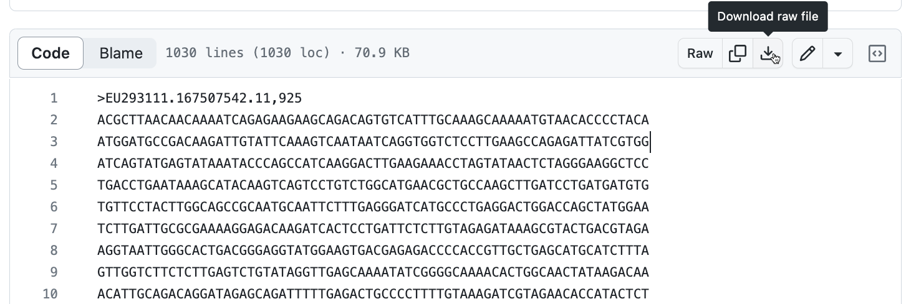
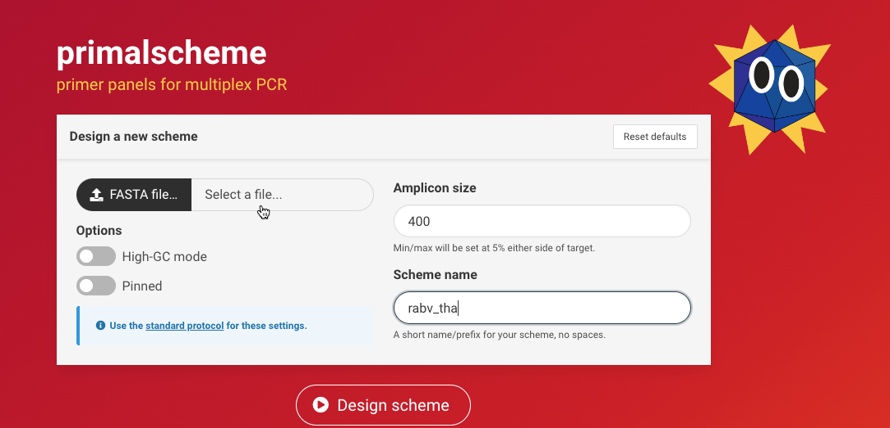
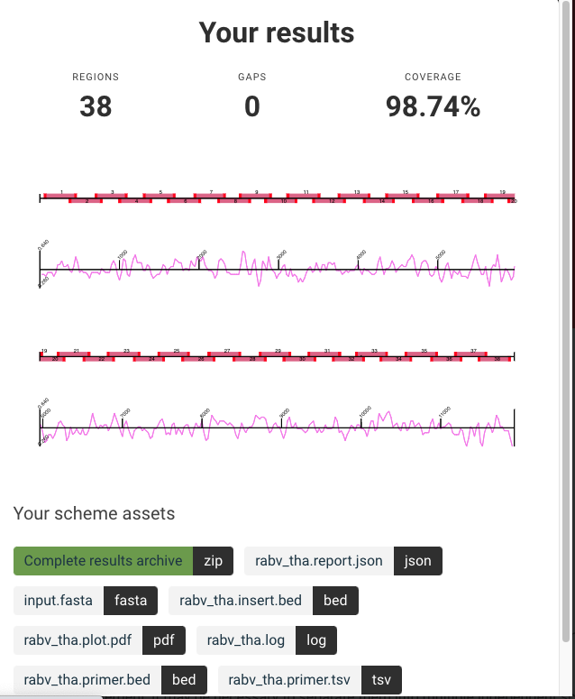

Targetting viral diversity
================

- <a href="#1-using-publicly-available-data"
  id="toc-1-using-publicly-available-data">1 Using publicly available
  data</a>
  - <a href="#11-ncbi" id="toc-11-ncbi">1.1 NCBI</a>
  - <a href="#12-introducing-rabv-glue"
    id="toc-12-introducing-rabv-glue">1.2 Introducing RABV-GLUE</a>
- <a href="#2-group-practical" id="toc-2-group-practical">2 Group
  practical</a>
  - <a href="#21-getting-a-dataset-from-rabv-glue"
    id="toc-21-getting-a-dataset-from-rabv-glue">2.1 Getting a dataset from
    RABV-GLUE</a>
  - <a href="#22-primalscheme" id="toc-22-primalscheme">2.2 primalscheme</a>
- <a href="#3-more-complicated-scenarios"
  id="toc-3-more-complicated-scenarios">3 More complicated scenarios</a>

# 1 Using publicly available data

In order to design primers we must have some knowledge of the viral
diversity we intend to capture. One way of gaining this *a priori*
knowledge is to utilise publicly available sequence data. If available,
public sequences can be used as references to guide primer design.

## 1.1 NCBI

Let’s start by going to one of the most comprehensive public
repositories for DNA sequence data: [NCBI
GenBank](https://www.ncbi.nlm.nih.gov/genbank/)

Let’s say we want to start sequencing canine rabies virus in Kenya…

Search for “rabies virus kenya”  
- How many results do we see?  
- Where is the associated metadata?

Now let’s try refining the search to find only genome sequences from
dogs  
- How many results are there?  
Try genome sequences from canis  
- How many results are there?

It becomes increasing difficult to refine searches in GenBank without
using command line based tools. Even then, the tools can only extract
from the information in the GenBank file. As we have seen, there is no
enforced standardisation of the metadata e.g. a sequence from a domestic
dog might be labelled as “dog”, “canis lupus familiaris”… etc

## 1.2 Introducing RABV-GLUE

<figure>


<figcaption>

Credit: Rob Gifford

</figcaption>
</figure>

GLUE is an open, integrated software toolkit that provides functionality
for storage and interpretation of sequence data.

RABV-GLUE is a rabies specific implementation of the GLUE framework. The
web GUI has a number of useful functionalities:  
- It curates sequences from GenBank, cleaning-up and standardising the
metadata  
- Presents results as a data table  
- Easy to filter data  
- Classifies rabies virus into major and minor clades

Let’s attempt the same refined search we tried in GenBank.

# 2 Group practical

## 2.1 Getting a dataset from RABV-GLUE

Go to [RABV-GLUE’s curated
database](http://rabv-glue.cvr.gla.ac.uk/#/home).

|                                                                                                                              |
|:-----------------------------------------------------------------------------------------------------------------------------|
| Task 1                                                                                                                       |
| Choose a country or global region to investigate. Use filters to search for whole genome sequences from this country/region. |

Questions:

*1. What clade assignment do these sequences have?*

*2. Do you think these sequences are suitable for designing primers? Are
there any potential issues that you can see?*

Click on the accession id of the sequence with host “Mus”, then click to
view the **NCBI Nucleotide DB Entry**. Scroll down to the Features
section. Note the isolation source.

*3. Why might this sequence be a problem?*

Navigate back to the RABV-GLUE table (it will still be an open tab).

|                                                                                                                                                                                                                                                                                                   |
|:--------------------------------------------------------------------------------------------------------------------------------------------------------------------------------------------------------------------------------------------------------------------------------------------------|
| Task 2                                                                                                                                                                                                                                                                                            |
| Open the Filter tab and add another filter to exclude host “Mus”. Download the sequences, changing the default filename to something suitable (keep the “.fasta”). When the file is ready to download **you must click on the link** to get the file, don’t hit ok until the file has downloaded! |

Note: imposing a filter on host automatically excludes entries with no
host information.

## 2.2 primalscheme

primalscheme is a tool for designing primer panels for multiplex PCR. Go
to the primalscheme [webpage](https://primalscheme.com/). It is pretty
simple: upload a fasta file, choose an amplicon length and a scheme
name, then press enter! However, there are some important things to note
before you upload any data (scroll down to instructions).

### 2.2.1 Check data

It advises checking your sequences in the tool Clustal Omega,
specifically to use the sequence identity matrix to check how closely
related your sequences are. We won’t do this here but the identity
matrix for your sequences is shown below.

*4. Can you see any problematic sequences?*

``` shell
#  Percent Identity  Matrix - created by Clustal2.1 
   1: LC717423    100.00   97.86   97.76   98.34   96.13   96.87   96.61   96.78   96.75
   2: LC717424     97.86  100.00   98.36   98.96   96.02   96.75   96.46   96.62   96.59
   3: EU293111     97.76   98.36  100.00   98.97   95.93   96.67   96.39   96.55   96.52
   4: LC717422     98.34   98.96   98.97  100.00   96.46   97.17   96.90   97.08   97.05
   5: MN075931     96.13   96.02   95.93   96.46  100.00   98.27   97.99   98.16   98.15
   6: LC717426     96.87   96.75   96.67   97.17   98.27  100.00   99.16   99.27   99.27
   7: LC717425     96.61   96.46   96.39   96.90   97.99   99.16  100.00   99.65   99.64
   8: LC717427     96.78   96.62   96.55   97.08   98.16   99.27   99.65  100.00  100.00
   9: LC717428     96.75   96.59   96.52   97.05   98.15   99.27   99.64  100.00  100.00  
```

### 2.2.2 Prune data

Sequences with \>99% identity should be removed. Based on the matrix, we
will remove sequences 7-9. A pruned sequence data file has been provided
for you [here](data/wgs_rabv_tha_pruned.fasta). Download it.



### 2.2.3 Create a scheme

Having checked and corrected the input data we will now proceed to
create a scheme.

|                                                                                                                                                                     |
|:--------------------------------------------------------------------------------------------------------------------------------------------------------------------|
| Task 3                                                                                                                                                              |
| Click on **select a file** to upload the pruned fasta file as input, leave the amplicon length as 400 and call the scheme “rabv_tha”. Then press **Design scheme**. |



You will get an on-screen output like below (note you may have to scroll
down to see the files):



The image shows an overview of the primer/amplicon positions on the
reference genome and indicates the level of coverage they provide
(98.74% of the genome).

You can choose to download the Complete results archive to look at all
the output files. The rabv_tha.primer.tsv file provides a list of primer
names, sequences and the multiplex pool they should be combined in. You
can use the info in the file to order your primers! *Note:* It is
important that the original names (e.g. rabv_tha_3\_RIGHT) are kept as
this informs downstream bioinformatics pipelines.

# 3 More complicated scenarios

It isn’t always as easy as this! We won’t go into this here but we are
publishing a paper soon that will contain additional advice to help with
primer design and optimisation.
